# POV-Blaster

POV-Blaster is a Python and Pygame first-person shooter built with a classic raycasting renderer. It is a direct fork of [StanislavPetrovV/DOOM-style-Game](https://github.com/StanislavPetrovV/DOOM-style-Game), based on the same Wolfenstein 3D-inspired approach.

The game uses a 2D grid map to produce a pseudo-3D view. It supports textured walls, animated scenery, mouse-look, WASD movement, a shotgun, enemy line of sight, BFS pathfinding, health, damage, victory, and game-over states.


## Table of Contents

- [Controls](#controls)
- [Requirements](#requirements)
- [Running the Script](#running-the-script)
- [Project Structure](#project-structure)
- [How the Game Works](#how-the-game-works)
- [Development Walkthrough](#development-walkthrough)
- [Assets](#assets)
- [Development Notes](#development-notes)
- [See Also](#see-also)
- [Project Lineage](#project-lineage)

## Controls

- `W`, `A`, `S`, `D`: move and strafe
- Mouse: look around
- Left mouse button: fire
- `Esc`: return to the startup menu

## Requirements

- Python 3.10 or newer
- Pygame
- A desktop environment with graphics and audio support

## Running the Script

Run these commands from the project root so the runtime resource paths resolve correctly.

### Windows

Create and activate a virtual environment, install the dependencies, and run the script:

```powershell
py -m venv .venv
.\.venv\Scripts\Activate.ps1
py -m pip install --upgrade pip
py -m pip install -r requirements.txt
py main.py
```

The game opens as a Windows desktop window. Press `Esc` to quit.

### Linux

Create and activate a virtual environment, install the dependencies, and run the script:

```bash
python3 -m venv .venv
source .venv/bin/activate
python3 -m pip install --upgrade pip
python3 -m pip install -r requirements.txt
python3 main.py
```

On WSL, the game needs a GUI provider. WSLg is supported automatically. If using VcXsrv, start VcXsrv with X11 access enabled, then run:

```bash
./build/POV-Blaster_lin
```

The Linux executable automatically detects a reachable VcXsrv display when running under WSL. If necessary, set `DISPLAY` manually to the Windows host display, for example `DISPLAY=172.19.64.1:0`.

## Build Executables

PyInstaller creates a native executable for the operating system where the build runs. Build Windows on Windows and Linux on Linux or WSL. Install the dependencies first using the instructions in [Running the Script](#running-the-script).

### Windows build

```powershell
py build.py -w
```

This creates:

```text
build/POV-Blaster_win.exe
```

### Linux build

Run on Linux or inside WSL:

```bash
./build.py -l
```

Or from PowerShell, invoking WSL with the Windows project path explicitly mounted:

```powershell
wsl bash -lc "cd /mnt/c/Users/Richard/Dropbox/Workspace/Code/Python/POV-Blaster && ./build.py -l"
```

This creates:

```text
build/POV-Blaster_lin
```

### macOS build

Run on macOS with Python, Pygame, and PyInstaller installed:

```bash
python3 build.py -m
```

This creates:

```text
build/POV-Blaster_mac.app
```

Open the application bundle from Finder or run it with:

```bash
open build/POV-Blaster_mac.app
```

### Browser build

Install the dependencies, then run the Pygbag target from the project root:

```bash
python3 build.py -b
# or: python3 build.py --web
```

This creates the browser build under `build/web`. To run it locally, start Pygbag's runtime-aware server against the staged web source:

```bash
python3 -m pygbag build/web-source
```

Then open `http://localhost:8000`. Pygbag's server provides the required `/cdn/` runtime route; a plain HTTP server is not sufficient. The web entry point uses an asynchronous game loop and browser-local storage for high scores. Desktop builds continue to use `scores.xml`. Pygbag's runtime may require a user click to unlock browser media before starting.

The Pygbag dev server re-packages the app fresh each time it starts, but not while running — so after any `python3 build.py --web` rebuild, you must stop and restart the dev server (Ctrl+C, then run `python3 -m pygbag build/web-source` again) for changes to actually take effect.

The `build.py` script rejects builds requested from the wrong operating system, preventing incorrectly named non-native executables. macOS builds must run on macOS because PyInstaller creates native artifacts for the host platform.

#### Deploying to GitHub Pages

`.github/workflows/deploy-pages.yml` builds the web target and publishes `build/web` to GitHub Pages automatically on every push to `main`. To enable it:

1. In the repository, go to **Settings → Pages** and set **Source** to **GitHub Actions**.
2. Push to `main` (or run the workflow manually from the **Actions** tab).
3. Once the workflow finishes, the game is served at `https://<username>.github.io/<repo>/`.

## Project Structure

```text
main.py              Game startup, event loop, update, and draw lifecycle
web_main.py          Async browser entry point for Pygbag
settings.py          Display, player, raycasting, and gameplay constants
map.py               Grid map and wall texture IDs
maps/                Predefined plain-text maps, including 1_mini_map_default.txt
player.py            Player movement, collision, health, and firing
raycasting.py        Wall ray traversal and wall-column projection
object_renderer.py   Background, walls, sprites, HUD, and end screens
sprite_object.py     Static and animated billboard sprites
object_handler.py    Scenery, NPC spawning, updates, and victory checks
npc.py               Enemy behavior, visibility, combat, and animation
pathfinding.py       Grid graph and breadth-first navigation
weapon.py            Shotgun animation and damage
sound.py             Music and sound effects
resources/           Runtime textures, sprites, and audio
theme.py             Theme definitions and startup selection
build.py             Windows, Linux, macOS, and browser build targets
generate_themes.ps1  Procedural theme and animation asset generator
screenshots/         Project screenshots
```

## How the Game Works

### Player movement

The player moves through a grid-based world using floating-point coordinates. Wall collision checks prevent movement into solid map cells, and diagonal movement is normalized so moving in two directions is not faster than moving in one direction. Mouse movement updates the camera angle.

### Raycasting

The renderer casts rays across the camera field of view. Each ray finds a horizontal or vertical wall intersection, calculates corrected distance, selects a wall texture, and projects a vertical wall strip onto the screen. The result is a lightweight pseudo-3D environment without a full 3D engine.

### Sprites and animation

Scenery, enemies, and the weapon use transparent 2D images projected into the first-person view. Animation folders contain frame sequences for idle, walk, attack, pain, death, lighting, and weapon recoil states.

### Enemies and pathfinding

Soldier, Cacodemon, and Cyberdemon enemies have different health, speed, attack range, damage, and accuracy settings. Enemies use line-of-sight checks to detect the player and breadth-first search to navigate around walls.

### Themes

The startup menu provides four content choices:

- Default: Soldier, Caco Demon, Cyber Demon
- Candy Kingdom: Marshmallow Man, Springfield Doughnut, Gingerbread Golem
- Space: Alien Drone, Alien Warrior, Alien Overlord
- Graveyard: Ghost, Vampire, Werewolf

Theme assets live under `resources/<theme>/`. To regenerate the themed textures and NPC animation frames on Windows, run:

```powershell
.\generate_themes.ps1
```

To validate existing animation folders without changing artwork, run:

```powershell
.\generate_themes.ps1 -ValidateOnly
```

To explicitly generate replacements for missing or duplicate numbered frames, add `-RepairFrames`.

Each generated NPC includes unique idle, walk, attack, pain, and death sequences. Candy Kingdom uses the imported CandyKingdom asset set, including the pastry-bag weapon and thick slime firing sound; its deaths melt the Marshmallow Man and crumble the Springfield Doughnut and Gingerbread Golem.

### Combat and game states

The shotgun fires from the center of the screen and applies damage to a visible enemy in the shot path. Player health recovers over time. Defeating all living enemies produces a victory state; health reaching zero produces a game-over state.

## Development Walkthrough

The following stages describe how POV-Blaster grows from a 2D map into a playable raycast shooter. The demonstrations are included for visual reference and represent the current project style and feature set.

### Player Movement

The player moves forward, backward, and sideways relative to the current viewing angle. Wall collision checks keep the player inside walkable cells, while diagonal movement correction keeps combined WASD input from increasing movement speed. Mouse-look changes the viewing angle and recenters the cursor when it approaches the configured screen border.

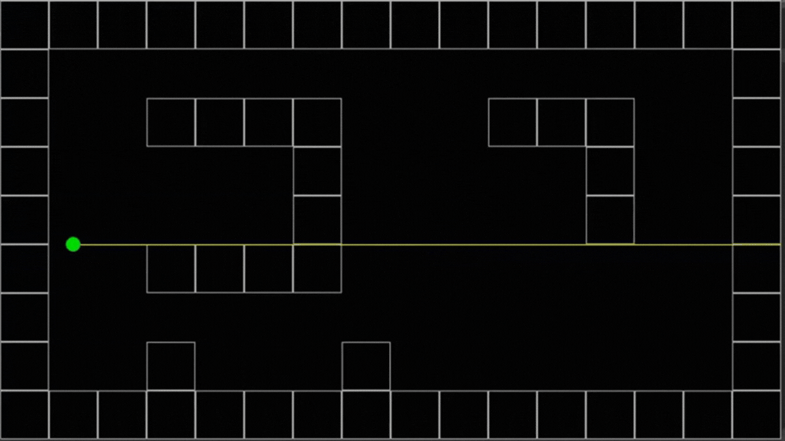

### Raycasting Algorithm

The camera field of view is the interval from the player angle minus half the FOV to the player angle plus half the FOV. POV-Blaster casts one ray for each configured screen column across that interval. Each ray stops at the first wall cell, providing the depth used to calculate the height of its projected vertical wall strip.

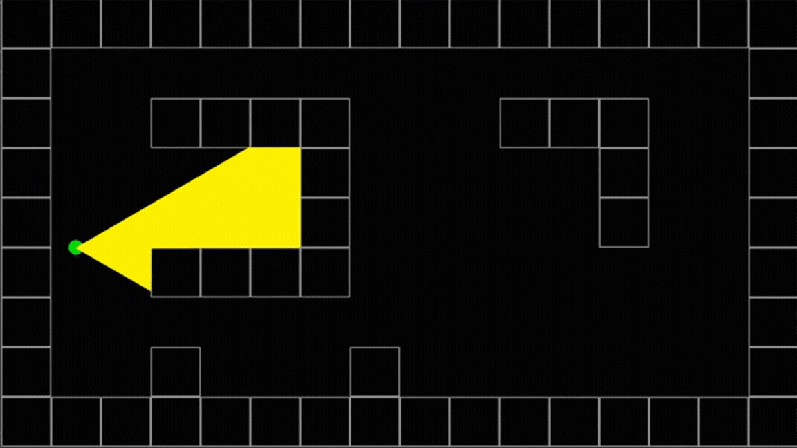


Distance correction removes the fishbowl effect that would otherwise make walls at the sides of the view appear distorted. Distance-based shading is a future rendering opportunity; the current renderer uses textured walls, a sky background, and a floor color.

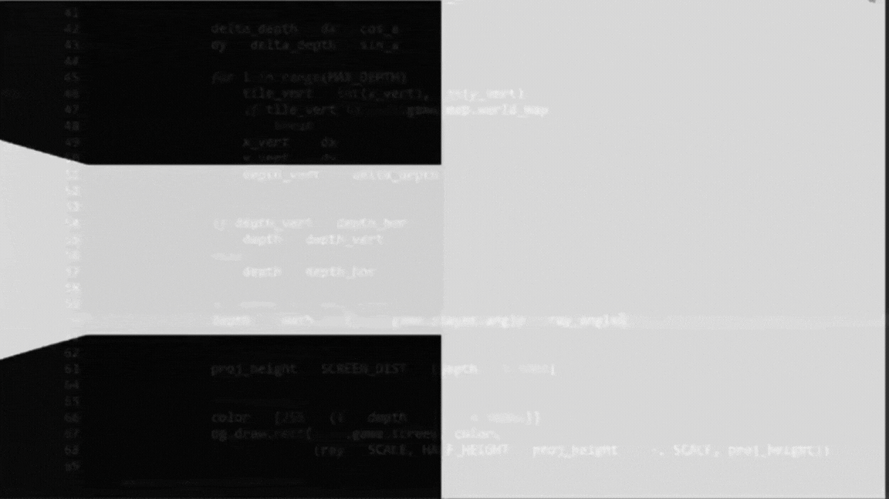


### Static and Animated Sprites

Scenery is added as transparent 2D billboard images positioned in the map. Animated sprites are sequences of images displayed over time. This supports environmental details such as lights and decorations without requiring a full polygonal 3D engine.

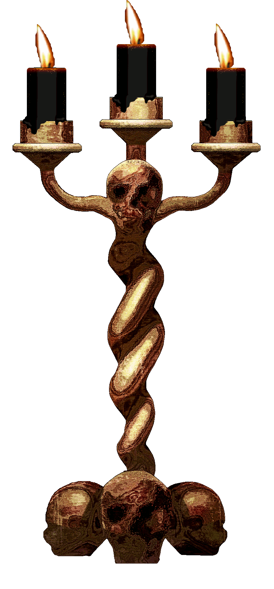

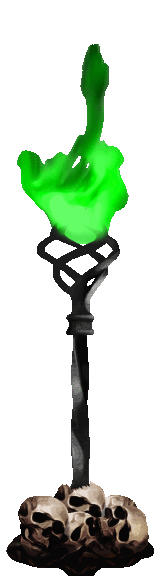

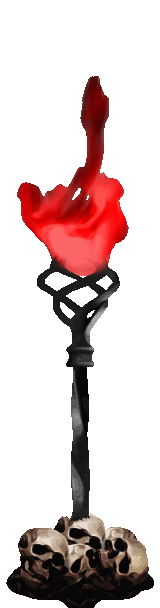


### Weapon and Shooting Animation

The shotgun is a foreground sprite animated from a sequence of recoil frames. Left-click starts the firing sound and animation, and the reload lockout prevents another shot until the animation completes. The current weapon uses a center-screen hitscan interaction with visible enemies.


### Player-Enemy Interaction and Pathfinding

Enemies first use line of sight to detect the player. A direct movement approach would fail when a wall blocks the straight-line route, so POV-Blaster uses breadth-first search over walkable map cells to find a route around obstacles. NPC occupancy is considered when enemies select their next cell.

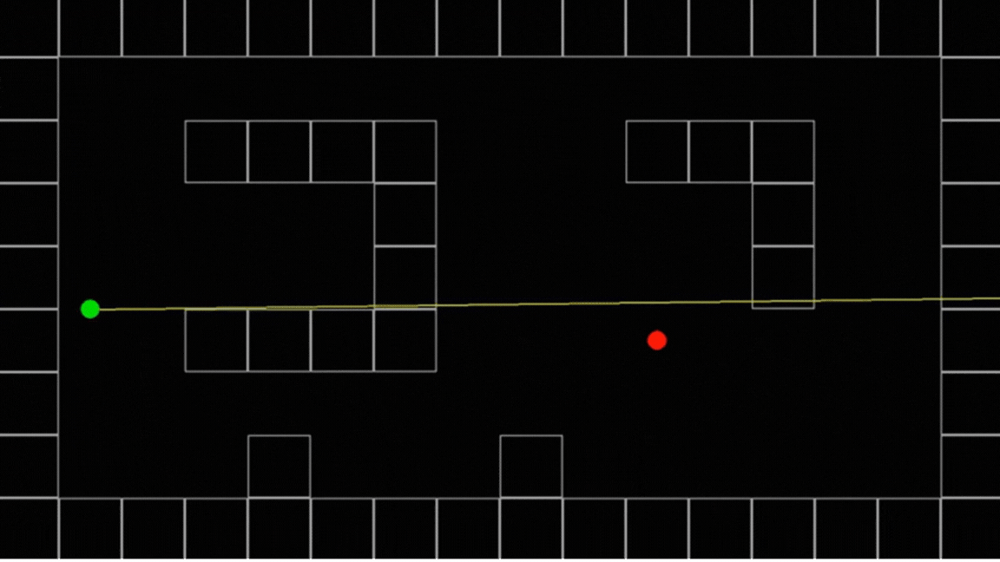

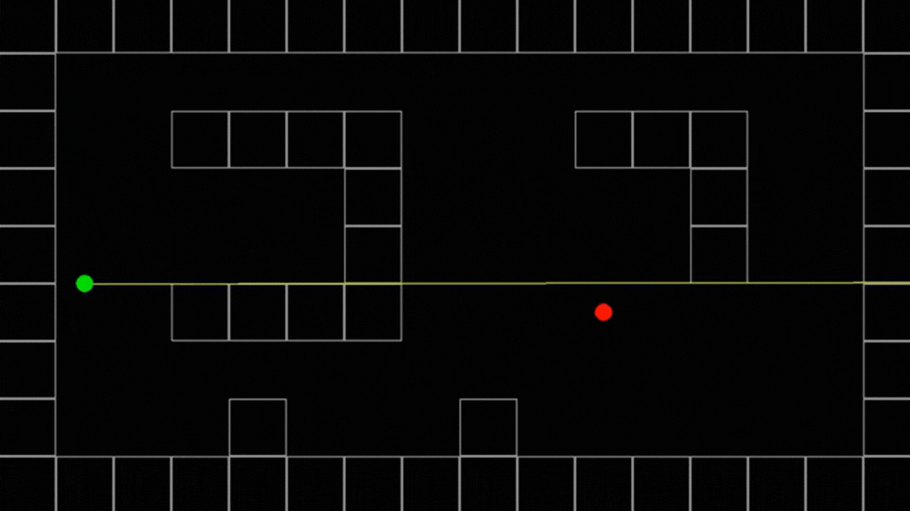

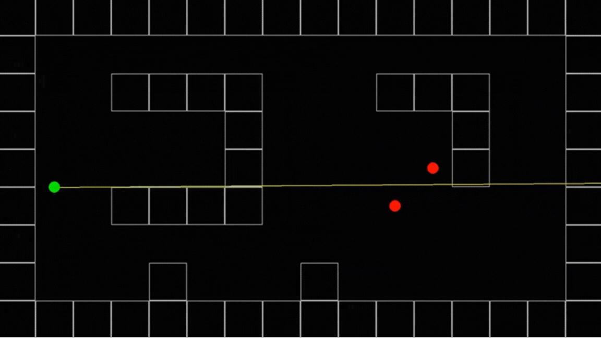

The current implementation is intentionally simple. Future improvements should schedule pathfinding work, avoid stale cache results, prevent diagonal corner cutting, and separate navigation rules from NPC rendering and combat.

### Enemies

POV-Blaster includes three enemy profiles. Each profile uses idle, walk, attack, pain, and death animations and has its own health, speed, attack range, damage, and accuracy values.

#### Soldier

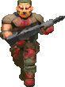

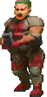

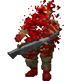

#### Cacodemon

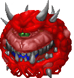

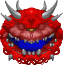

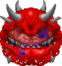

#### Cyberdemon

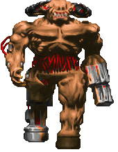

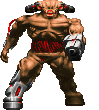

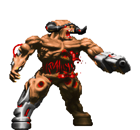

### Final Gameplay

The complete gameplay loop combines movement, mouse-look, raycast rendering, textured walls, animated scenery, enemy detection and navigation, shotgun combat, health and damage feedback, sound effects, and victory/game-over transitions.


## Assets

Runtime assets are stored under `resources/`:

```text
resources/
├── sound/
├── sprites/
│   ├── animated_sprites/
│   ├── npc/
│   ├── static_sprites/
│   └── weapon/
└── textures/
    └── digits/
```

Keep asset paths relative to the project resource root. The asset-loading and packaging strategy is scheduled for improvement as part of the production refactoring plan.

## Development Notes

The current implementation is a compact prototype and is intentionally being evolved toward cleaner architecture. The next improvements should prioritize:

- Correct frame presentation and non-blocking game-state transitions.
- Safe raycasting edge-case handling and a shared traversal implementation.
- Deterministic animation loading and valid, unique NPC spawning.
- Asset caching, stable resource paths, and audio fallback behavior.
- Separation of domain rules from Pygame rendering, input, audio, and filesystem code.
- Unit tests, headless integration tests, profiling, and CI validation.

See the audit and comparison reports before making foundational changes.

## See Also

- [CodeBase.md](docs/CodeBase.md): reconstruction guide and codebase walkthrough
- [CodeAudit.md](docs/CodeAudit.md): architecture, quality, performance, and scalability audit
- [CloneCompare.md](docs/CloneCompare.md): comparison of the related game projects and first-patch recommendations
- [CHANGELOG.md](CHANGELOG.md): project history and prior development prompts

## Project Lineage

POV-Blaster is a direct fork of [StanislavPetrovV/DOOM-style-Game](https://github.com/StanislavPetrovV/DOOM-style-Game). The related [Saurabh-66/DOOM-3D-FPS-Shooting-Game](https://github.com/Saurabh-66/DOOM-3D-FPS-Shooting-Game) project was also compared during planning; see [CloneCompare.md](docs/CloneCompare.md) for the source-similarity evidence and recommended improvements.
