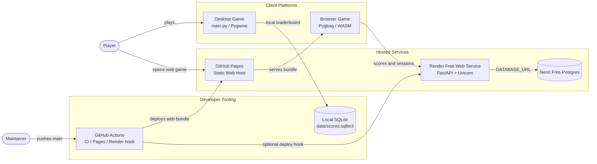
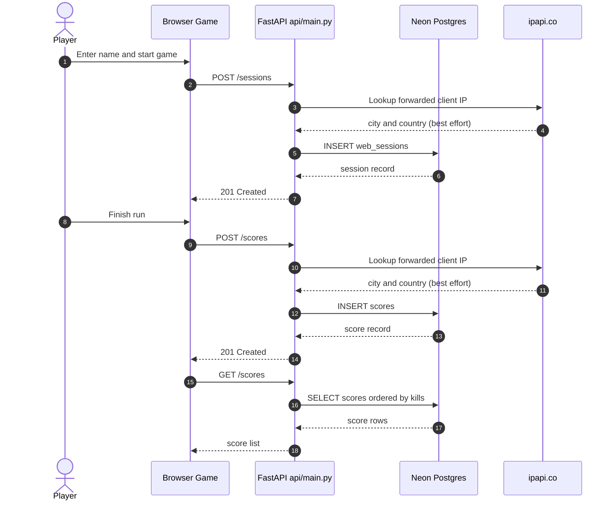
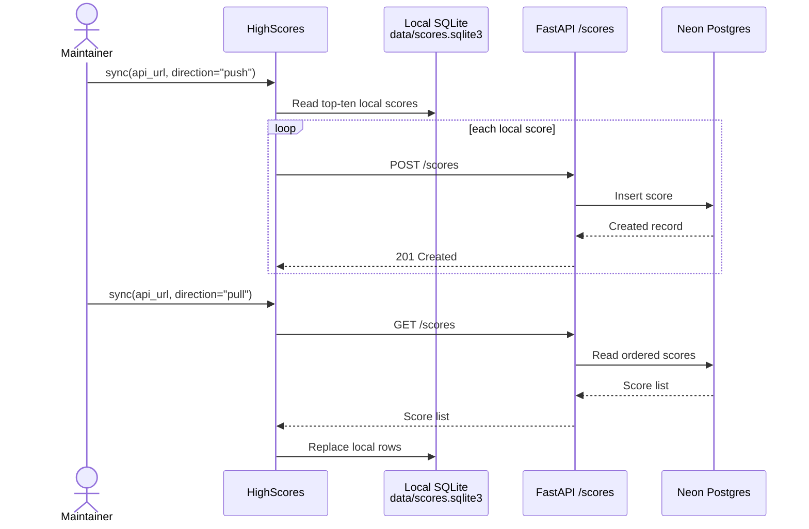
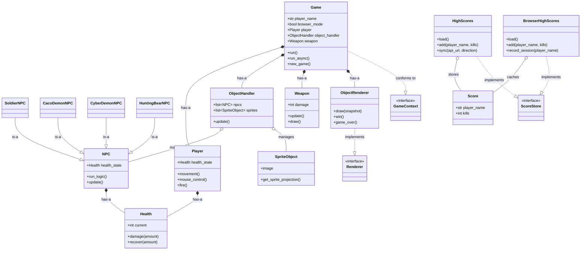
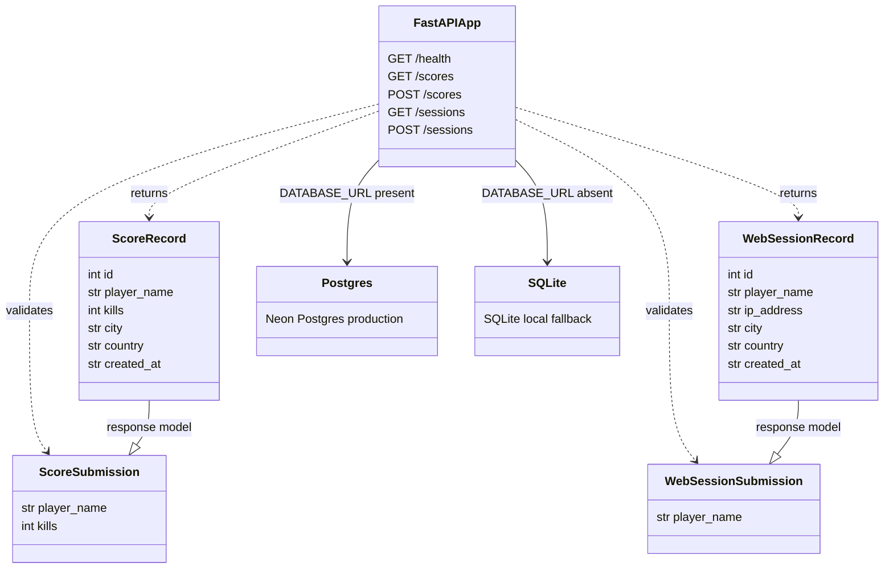

# POV-Blaster System Architecture Diagrams

These diagrams use Mermaid syntax. GitHub renders the diagrams directly, and they can be previewed in VS Code with the built-in Markdown preview. Open the preview with **Markdown: Open Preview** or **Markdown: Open Preview to the Side** while viewing this file.

## System Context

## Web Score Sequence

## Local/Remote Score Synchronization

## Runtime Class Diagram

## API Class Diagram

## Relationship Legend

- `--|>` means **Is-A** inheritance.
- `..|>` means interface implementation or protocol conformance.
- `*--` means strong **Has-A** composition: the owner creates and controls the part.
- `o--` means aggregation: the owner manages related objects that can exist independently.
- `-->` means a runtime dependency or request/data flow.
