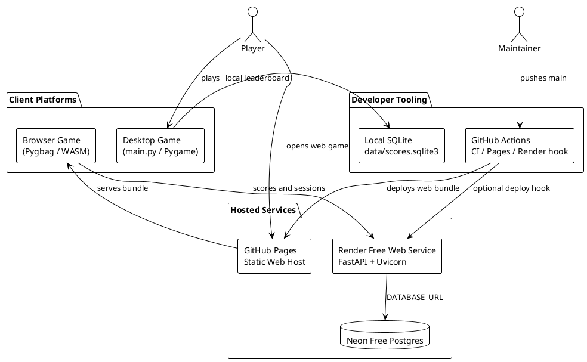
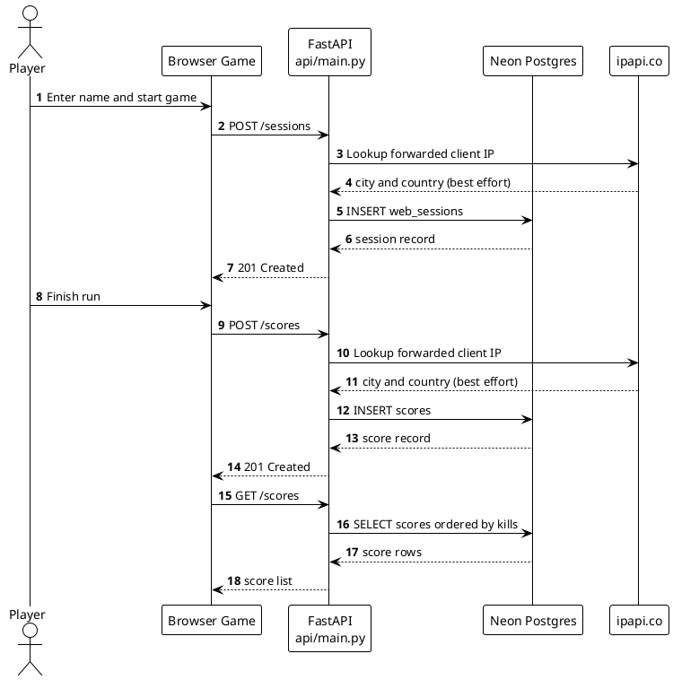
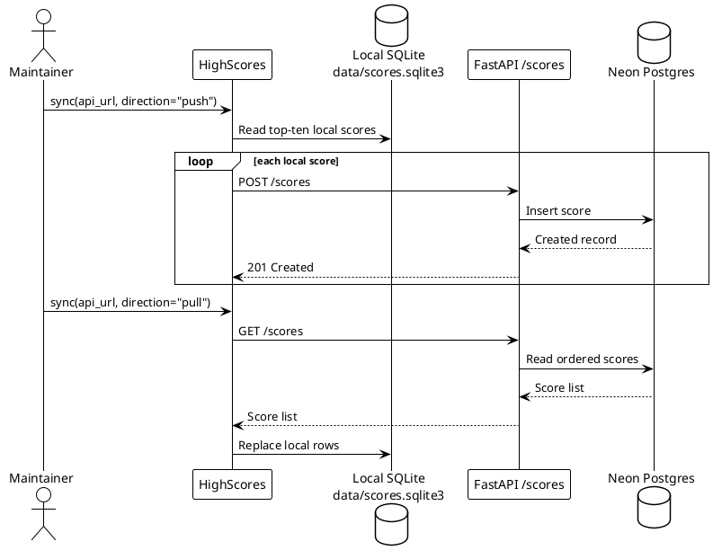
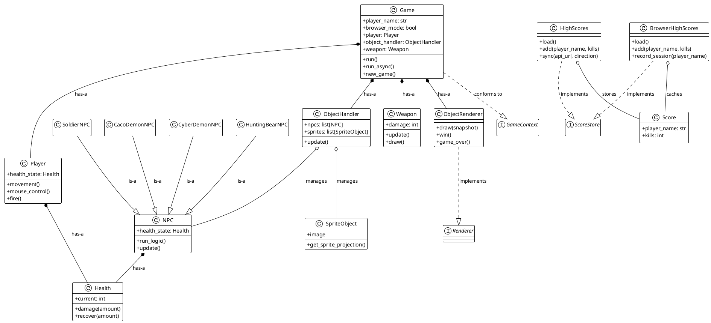

# POV-Blaster System Architecture Diagrams

These diagrams use PlantUML syntax and can be previewed in VS Code with the PlantUML extension. Open this file and run **PlantUML: Preview Current Diagram** for the selected diagram block.

## System Context



## Web Score Sequence



## Local/Remote Score Synchronization



## Runtime Class Diagram



## API Class Diagram

```plantuml
@startuml
!theme plain
skinparam classAttributeIconSize 0
skinparam shadowing false

class FastAPIApp {
  GET /health
  GET /scores
  POST /scores
  GET /sessions
  POST /sessions
}

class ScoreSubmission {
  player_name: str
  kills: int
}

class ScoreRecord {
  id: int
  player_name: str
  kills: int
  city: str
  country: str
  created_at: str
}

class WebSessionSubmission {
  player_name: str
}

class WebSessionRecord {
  id: int
  player_name: str
  ip_address: str
  city: str
  country: str
  created_at: str
}

database "Neon Postgres\nproduction" as Postgres
database "SQLite\nlocal fallback" as SQLite

FastAPIApp ..> ScoreSubmission : validates
FastAPIApp ..> ScoreRecord : returns
FastAPIApp ..> WebSessionSubmission : validates
FastAPIApp ..> WebSessionRecord : returns
FastAPIApp --> Postgres : DATABASE_URL present
FastAPIApp --> SQLite : DATABASE_URL absent
ScoreRecord --|> ScoreSubmission : is-a response model
WebSessionRecord --|> WebSessionSubmission : is-a response model
@enduml
```

## Relationship Legend

- `--|>` means **Is-A** inheritance.
- `..|>` means interface implementation or protocol conformance.
- `*--` means strong **Has-A** composition: the owner creates and controls the part.
- `o--` means aggregation: the owner manages related objects that can exist independently.
- `-->` means a runtime dependency or request/data flow.
